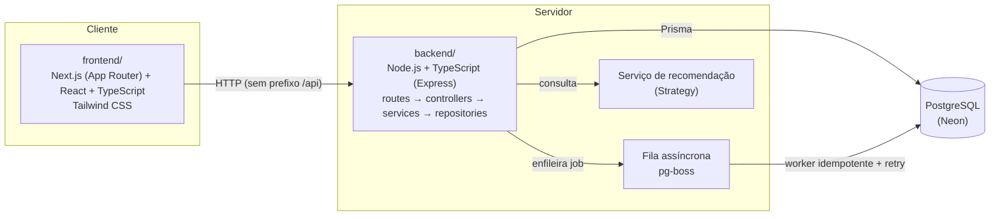

# Origem

Marketplace web full stack que conecta artesãos e produtores criativos de Pernambuco a compradores de todo o Brasil, dando visibilidade digital, canal de venda direto e valorização da origem, da técnica e da história de cada peça.

Projeto Integrador do 4º semestre de Análise e Desenvolvimento de Sistemas — **CESAR School**, 2026.2.

## Acesse a aplicação

**Frontend publicado:** <https://origem-marketplace.vercel.app/>

Na Avaliação 1, o frontend roda com uma Fake API no navegador (detalhes em [`docs/fake-api.md`](docs/fake-api.md)), sem depender do backend. Para avaliar os fluxos, use as credenciais sintéticas abaixo:

| Papel | Email | Senha |
|---|---|---|
| Comprador | `ana.compradora@origem.test` | `senha-sintetica-comprador` |
| Artesão | `joao.artesao@origem.test` | `senha-sintetica-artesao` |
| Artesã | `maria.artesa@origem.test` | `senha-sintetica-artesao-02` |
| Admin | `admin@origem.test` | `senha-sintetica-admin` |

> Os dados ficam no `localStorage` de cada navegador: pedidos, cadastros e produtos criados por um visitante não aparecem para outro, e cada acesso começa da mesma massa sintética. Para uma demonstração limpa, use uma janela anônima.

**Branch principal:** `main` (cada push publica automaticamente na Vercel).

## O problema

Artesãos e produtores criativos têm pouca visibilidade digital, dependem de intermediários e têm gestão precária de catálogo, pedidos e estoque. Falta um canal que conecte essa produção a compradores destacando origem, técnica e o impacto de comprar direto de quem faz.

O projeto nasce com uma âncora real: a **Comunidade do Pilar** (Recife), com expansão possível para **Alto do Moura/Caruaru** e **Tracunhaém**.

## O que o produto faz

- **Vitrine do comprador** — busca, filtros, perfil do artesão, carrinho e avaliações.
- **Painel do artesão** — catálogo, estoque e gestão de pedidos.
- **Painel administrativo** — curadoria e indicadores da plataforma.
- **Recomendação de produtos** — módulo de IA exposto como serviço, consumido pela vitrine.
- **Indicadores de venda** para artesãos e administração.

Escopo deliberadamente controlado para caber em um semestre: poucas categorias, dados representativos/sintéticos, pagamento simulado (sem gateway real) e recomendação em nível didático antes de modelos sofisticados.

## Arquitetura

Monorepo com dois projetos independentes — `frontend/` e `backend/` — comunicando-se por HTTP.



**Camadas do backend:** `routes` → `controllers` → `services` → `repositories`, com `middlewares` para cross-cutting concerns e `validators` para DTO/validação na borda (Zod). Padrões aplicados de forma pontual e justificada — Repository, Service layer, Strategy (integração de recomendação) e a chain de middlewares do Express — sem Clean Architecture completa, CQRS ou framework de DI, que não se justificam para o tamanho do projeto.

**Concorrência (FCCPD):** o ponto mais sensível do domínio é a baixa de estoque no checkout. A abordagem escolhida é lock pessimista explícito em transação (`SELECT ... FOR UPDATE`) em vez de update condicional otimista — mais simples de implementar, mas o lock explícito demonstra de forma mais didática o controle de concorrência que a disciplina avalia.

**Processamento assíncrono:** após a confirmação de um pedido, um job é publicado em uma fila (`pg-boss`, sobre o próprio PostgreSQL) e processado por um worker idempotente com retry — desacoplando o fluxo síncrono de checkout de efeitos colaterais como notificação ao artesão.

## Decisões de stack

| Camada | Escolha | Por quê |
|---|---|---|
| Frontend | Next.js (App Router) + React + TypeScript + Tailwind CSS | Padrão da disciplina de Desenvolvimento Web; SSR/roteamento por arquivos reduz boilerplate |
| Backend | Node.js + TypeScript + Express | Projeto separado do frontend, seguindo a stack de referência da disciplina (Express + Prisma + JWT) |
| Banco de dados | PostgreSQL (Neon) | Serverless, branch de banco para testes de integração |
| ORM | Prisma | Migrations versionadas e tipagem gerada a partir do schema |
| Fila assíncrona | pg-boss | Fila sobre o próprio Postgres — sem infra extra para atender ao critério de processamento assíncrono do FCCPD |
| Autenticação | JWT (emitido pelo Express) + bcrypt + cookie `httpOnly` | Backend é projeto separado do frontend; descarta NextAuth |
| Storage de imagens | Vercel Blob | SDK/token funciona a partir de qualquer backend, independente de onde ele está hospedado |
| Deploy frontend | Vercel | Integração nativa com Next.js |
| Deploy backend | Render (free tier) | Sem cartão de crédito, processo persistente (compatível com fila/cache); dorme após 15 min de inatividade |
| Testes | Vitest/Jest (unitário e integração), Playwright (E2E), script dedicado com `Promise.all` (concorrência) | Cobre desde unidade até evidência de concorrência exigida pela rubrica de FCCPD |

Pagamento é sempre simulado — este projeto não integra nem deve integrar gateways de pagamento reais.

## Estrutura de pastas

```
Projeto integrador/
├── backend/                 # API Node.js + TypeScript (Express)
│   ├── src/
│   │   ├── routes/          # definição de endpoints
│   │   ├── controllers/     # entrada HTTP
│   │   ├── services/        # regras de negócio
│   │   ├── repositories/    # acesso a dados (Prisma)
│   │   ├── middlewares/     # cross-cutting concerns
│   │   ├── validators/      # DTO/validação na borda (Zod)
│   │   ├── queues/ e jobs/  # fila assíncrona (pg-boss)
│   │   ├── integrations/    # ex.: cliente do serviço de recomendação
│   │   └── database/prisma/ # schema e cliente Prisma
│   ├── prisma/               # migrations e seed
│   └── scripts/               # scripts de evidência (ex.: teste de concorrência)
├── frontend/                # aplicação Next.js
│   └── src/
│       ├── app/              # rotas (App Router)
│       ├── components/       # componentes por domínio de tela
│       ├── services/          # camada de acesso a dados (Fake API / futura API real)
│       ├── fake-api/          # Fake API estruturada usada na Avaliação 1
│       ├── domain/, store/, hooks/, types/, validators/
├── docs/                    # documentação publicada: fake-api.md e uso-de-ia.md
├── sprints/                 # entregáveis formais por sprint/checkpoint
└── CLAUDE.md                # contexto vivo do projeto (decisões, modelo de dados, cronograma)
```

## Como rodar localmente

Pré-requisitos: Node.js 24+, npm e um banco PostgreSQL (recomendado: Neon).

### Backend

```bash
cd backend
npm install
npm run prisma:generate

# configurar variáveis de ambiente antes de continuar:
# DATABASE_URL=<connection string do Postgres>

npm run db:migrate
npm run db:seed
npm run dev        # sobe o servidor em http://127.0.0.1:<PORT>
```

`GET /health` confirma o acesso ao banco (`200` com banco disponível, `503` caso contrário). As rotas da API não usam prefixo `/api` (ex.: `/pedidos`).

Antes de qualquer entrega, rodar também:

```bash
npm run typecheck
npm run lint
npm test
npm run test:concorrencia   # script dedicado de evidência de concorrência
```

### Frontend

```bash
cd frontend
npm install
npm run dev         # http://localhost:3000
```

Na Avaliação 1, o frontend consome uma **Fake API estruturada** (`src/fake-api/`), com a mesma camada de services/hooks/store que será usada para consumir a API real na Avaliação 2 — a integração real entre as camadas é entregue nessa segunda fase, sem reescrever a estrutura do frontend.

A documentação completa da Fake API (camadas, recursos, contratos, erros, rotas protegidas e plano de troca pelo backend) está em [`docs/fake-api.md`](docs/fake-api.md).

## Testes de FCCPD

Seção dedicada aos dois critérios centrais da rubrica de FCCPD — controle de concorrência no checkout e fila assíncrona — com o que rodar para gerar evidência real, não só descrita.

Pré-requisito: backend configurado (`npm install`, `npm run prisma:generate`, `DATABASE_URL` setada) — ver [Como rodar localmente](#como-rodar-localmente).

### Concorrência no checkout (lock pessimista)

Valida que `SELECT ... FOR UPDATE` impede overselling quando dois pedidos concorrem pelo mesmo item em estoque.

```bash
cd backend
npm test -- tests/integration/pedidos.integration.test.ts
npm run test:concorrencia   # scripts/concorrencia-checkout.ts — sobe o servidor real e dispara requisições HTTP concorrentes
```

`test:concorrencia` é o script de evidência exigido pela rubrica: cria produto/estoque, dispara `POST /pedidos` simultâneos de verdade contra o servidor e falha se qualquer rodada permitir estoque negativo. A saída do terminal (rounds + falhas) é a evidência a anexar na entrega.

### Fila assíncrona (pg-boss)

Valida publicação, processamento idempotente, retry e desacoplamento do job de notificação ao artesão.

```bash
cd backend
npm test -- tests/integration/fila-notificacao.integration.test.ts
npm test -- tests/integration/notificacao-auto-publish.integration.test.ts
npm test -- tests/integration/server-queue-bootstrap.integration.test.ts
```

| Teste | O que cobre |
|---|---|
| `fila-notificacao.integration.test.ts` | Publicação do job, handler idempotente, retry após falha simulada |
| `notificacao-auto-publish.integration.test.ts` | Publicação automática da intenção de notificação a partir de um pedido confirmado |
| `server-queue-bootstrap.integration.test.ts` | Bootstrap da fila (`boss.start()` + worker registrado) na subida real do servidor |

Implementação em `backend/src/queues/` (publisher, cliente pg-boss) e `backend/src/jobs/` (handler + worker do job `notificar-artesao`).

### Rodar tudo de uma vez

```bash
cd backend
npm test          # suíte completa (unit + integration), inclui os testes acima
npm run typecheck
npm run lint
```

## Documentação

| Documento | Conteúdo |
|---|---|
| [`docs/fake-api.md`](docs/fake-api.md) | Fake API da Avaliação 1: arquitetura, recursos, contratos, erros e troca pelo backend real |
| [`docs/uso-de-ia.md`](docs/uso-de-ia.md) | Declaração de uso de IA no desenvolvimento |

## Declaração de uso de IA

O uso de ferramentas de IA no desenvolvimento do projeto está declarado em [`docs/uso-de-ia.md`](docs/uso-de-ia.md).

## Disciplinas envolvidas

O Projeto Integrador é avaliado por 6 disciplinas do semestre, cada uma responsável por uma fatia do sistema. O bloco do PI vale no mínimo 40% da nota de cada unidade nas disciplinas técnicas.

| Disciplina | Papel no projeto |
|---|---|
| **Desenvolvimento Web** | Constrói a aplicação full stack — frontend responsivo e backend (API, regras de negócio) — integrando as contribuições das demais disciplinas |
| **Modelagem e Projeto de Banco de Dados** | Projeta e implementa o banco (modelo conceitual, lógico e físico), normalização e índices |
| **Requisitos, Projeto de Software e Validação** | Análise de domínio, requisitos, arquitetura (SOLID/GRASP/padrões) e estratégia de testes |
| **Fundamentos de Computação Concorrente, Paralela e Distribuída (FCCPD)** | Controle de concorrência no checkout/estoque e processamento assíncrono via fila |
| **Engenharia de Software e IA** (eletiva) | Módulo de recomendação de produtos, exposto como serviço consumido pela Web |
| **Projeto 4** | Acompanha processo, organização e integração entre as disciplinas — não avalia mérito técnico |

## Time

| Integrante | GitHub |
|---|---|
| Pedro Monteiro | [@devpedrois](https://github.com/devpedrois) |
| Andrews Queiroz | [@4ndrewss](https://github.com/4ndrewss) |
| Ricardo Severiano | [@byteric](https://github.com/byteric) |
| Eduardo Borges | [@Eduardo-Borges18](https://github.com/Eduardo-Borges18) |
| Eliziane Mota | [@Lizimota](https://github.com/Lizimota) |
| Luiz Henrique Rocha | [@Luizrocha0](https://github.com/Luizrocha0) |
| Sérgio Chousinho | [@sergiochou](https://github.com/sergiochou) |
| Luiza Vieira | [@vbluuiza](https://github.com/vbluuiza) |

## Licença

Projeto acadêmico desenvolvido para o Projeto Integrador da CESAR School. Sem licença de uso comercial.
