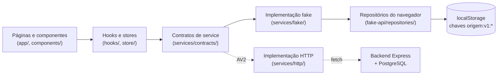

# Fake API do frontend (Avaliação 1)

Na Avaliação 1 (AV1), o frontend do Origem **não chama o backend**. Toda leitura
e escrita passa por uma **Fake API estruturada**, que roda no navegador e
guarda os dados no `localStorage`. Ela segue os contratos que a API real vai
implementar na Avaliação 2 (AV2). Para trocar a Fake API pelo backend, basta
mudar o ponto de composição dos services; páginas, componentes, hooks e
stores continuam iguais.

> Aplicação publicada: <https://origem-marketplace.vercel.app/>

## Sumário

- [Arquitetura em camadas](#arquitetura-em-camadas)
- [Recursos simulados](#recursos-simulados)
- [Massa sintética (seed)](#massa-sintética-seed)
- [Contratos dos services](#contratos-dos-services)
- [Erros de domínio](#erros-de-domínio)
- [Sessão e rotas protegidas](#sessão-e-rotas-protegidas)
- [Estados de interface](#estados-de-interface)
- [Troca pelo backend real (AV2)](#troca-pelo-backend-real-av2)
- [Limitações conhecidas](#limitações-conhecidas)

## Arquitetura em camadas



Regras que valem para todas as camadas:

- **Páginas e componentes nunca importam seeds nem acessam `localStorage`.**
  Eles consomem hooks e stores, que por sua vez consomem services.
- **Todo service é assíncrono** (`Promise`). Uma latência simulada de 300 ms
  (`LATENCIA_PADRAO_MS` em `services/fake/container.ts`) deixa os estados de
  carregamento visíveis e testáveis.
- **Os repositórios usam chaves versionadas** (`origem:v1:<recurso>`) e um
  seed idempotente: o seed só grava quando a chave ainda não existe, então
  recarregar a página não apaga alterações feitas pelo usuário.
- **A composição fica num único arquivo**, `services/fake/container.ts`. É o
  único ponto que muda na troca pelo backend.

## Recursos simulados

| Recurso | Service (contrato) | Repositório / storage | Chave no `localStorage` |
|---|---|---|---|
| Usuários | `UsuariosService` | `usuario.repository.ts` | `origem:v1:usuarios` |
| Sessão | `SessionStore` | `sessao.storage.ts` | `origem:v1:sessao` |
| Produtos | `ProdutosService` | `produto.repository.ts` | `origem:v1:produtos` |
| Categorias, técnicas e regiões | `OpcoesFiltroService` | seeds somente leitura | — |
| Carrinho | `CartStore` | `carrinho.storage.ts` | `origem:v1:carrinho:<usuarioId>` |
| Pedidos | `PedidosService` | `pedido.repository.ts` | `origem:v1:pedidos` |
| Perfil do artesão | `PerfilArtesaoService` | `perfil-artesao.repository.ts` | `origem:v1:perfis-artesao` |
| Recomendações | `RecomendacoesService` | lê o repositório de produtos | — |

Os caminhos são relativos a `frontend/src/`. Contratos ficam em
`services/contracts/`, implementações fake em `services/fake/` e repositórios
em `fake-api/repositories/`.

## Massa sintética (seed)

Os dados iniciais ficam em `frontend/src/fake-api/seeds/` e são **somente
sintéticos**:

| Seed | Conteúdo |
|---|---|
| `usuarios.seed.ts` | 4 usuários: 1 comprador, 2 artesãos e 1 admin |
| `produtos.seed.ts` | 30 produtos gerados de forma determinística, distribuídos por 5 categorias e pelos 2 artesãos, com estoques variados |
| `categorias.seed.ts` | As 6 categorias oficiais (a sexta fica sem produtos de propósito) |
| `tecnicas.seed.ts`, `regioes.seed.ts` | Opções dos filtros de busca e do perfil do artesão |
| `perfis-artesao.seed.ts` | Perfis dos 2 artesãos, para exercitar os casos de perfil completo e incompleto |

### Credenciais de teste

O papel `admin` só existe pelo seed; o cadastro público aceita apenas
`comprador` ou `artesao`.

| Papel | Email | Senha |
|---|---|---|
| Comprador | `ana.compradora@origem.test` | `senha-sintetica-comprador` |
| Artesão | `joao.artesao@origem.test` | `senha-sintetica-artesao` |
| Artesã | `maria.artesa@origem.test` | `senha-sintetica-artesao-02` |
| Admin | `admin@origem.test` | `senha-sintetica-admin` |

## Contratos dos services

Os comentários de cada contrato em `services/contracts/` descrevem as regras
em detalhe. Resumo:

```ts
interface UsuariosService {
  list(): Promise<UsuarioPublico[]>;               // nunca devolve senha
  register(input: CadastroInput): Promise<UsuarioPublico>;
  login(input: LoginInput): Promise<UsuarioSessao>; // erro genérico em qualquer falha
}

interface ProdutosService {
  list(): Promise<Produto[]>;
  search(query: ProdutoQuery): Promise<Produto[]>;  // termo + categoria/técnica/região (AND)
  listByArtesao(artesaoId: string): Promise<Produto[]>;
  create(input: NovoProdutoInput, artesaoId: string): Promise<Produto>;
  update(id: string, input: NovoProdutoInput, artesaoId: string): Promise<Produto>;
  remove(id: string, artesaoId: string): Promise<void>; // remoção lógica (ativo = false)
}

interface PedidosService {
  confirmar(itens: ItemPedidoInput[], compradorId: string): Promise<Pedido>;
}

interface PerfilArtesaoService {
  obter(artesaoId: string): Promise<PerfilArtesao | null>;
  salvar(input: PerfilArtesaoInput, artesaoId: string): Promise<PerfilArtesao>;
}

interface RecomendacoesService {
  obter(contexto: { produtoId: string } | { usuarioId: string }):
    Promise<{ estrategia: string; itens: Produto[] }>;
}

interface OpcoesFiltroService {
  categorias(): Promise<readonly Categoria[]>;
  tecnicas(): Promise<readonly Tecnica[]>;
  regioes(): Promise<readonly Regiao[]>;
}
```

Regras que os services aplicam, independentemente da tela:

- **Autoria vem da sessão.** `artesaoId` e `compradorId` são passados pela
  camada que lê a sessão, nunca por campos de formulário. O artesão só altera
  os próprios produtos e o próprio perfil.
- **Checkout recalcula tudo.** `PedidosService.confirmar` ignora preço e total
  vindos da interface, revalida o estoque de cada item contra o produto
  persistido, baixa o estoque e soma `quantidadeVendida`. Se qualquer item
  falhar, nada é gravado. Cada pedido recebe um `numeroConfirmacao` único.
- **O carrinho respeita o estoque.** `CartStore` bloqueia adicionar ou alterar
  quantidade acima do estoque disponível, aceita só quantidades inteiras e
  recalcula o total a cada mudança.
- **Visibilidade pública.** Produtos inativos ou sem estoque não aparecem na
  vitrine, na busca, no perfil público nem nas recomendações. O próprio
  artesão continua vendo seus produtos sem estoque
  (`domain/produto-visibilidade.ts`).
- **Recomendação determinística.** `FakeRecommendationAdapter` aplica a mesma
  especificação de ranking da baseline do backend (categoria, região, vendas,
  nota média e desempate estável) e devolve até 8 itens no mesmo formato de
  `GET /recomendacoes`.

## Erros de domínio

Todos os services lançam `ServiceError` (`services/errors.ts`), com `code`
estável, `message` legível e `details` opcionais. As telas tratam o erro pelo
`code`, nunca pelo texto.

| Código | Onde ocorre |
|---|---|
| `CADASTRO_INVALIDO` | Cadastro com campos inválidos |
| `PAPEL_INVALIDO` | Tentativa de cadastro com papel diferente de comprador ou artesão |
| `EMAIL_JA_CADASTRADO` | Email já usado (comparação normalizada: caixa e espaços) |
| `CREDENCIAIS_INVALIDAS` | Login incorreto ou usuário inativo (mesma mensagem nos dois casos) |
| `ACESSO_NEGADO` | Artesão tentando editar ou remover produto de outra conta |
| `PRODUTO_INVALIDO` | Criação ou edição de produto com dados inválidos |
| `PRODUTO_NAO_ENCONTRADO` | Produto inexistente na edição ou remoção |
| `PRODUTO_INDISPONIVEL` | Produto inativo no momento do checkout |
| `ESTOQUE_INSUFICIENTE` | Carrinho ou checkout acima do estoque; `details` indica o produto |
| `CARRINHO_VAZIO` | Checkout sem itens |
| `PERFIL_ARTESAO_INVALIDO` | Perfil do artesão com dados inválidos |

## Sessão e rotas protegidas

- O `SessionStore` persiste apenas `id`, `nome` e `papel` (nunca a senha) e
  restaura a sessão antes de renderizar as áreas protegidas.
- O `RouteGuard` (`components/layout/RouteGuard.tsx`) protege as rotas abaixo.
  Visitante vai para `/login` com retorno seguro (destinos externos são
  recusados); papel incorreto vê uma tela de acesso negado.

| Rota | Acesso |
|---|---|
| `/`, `/artesao/[id]`, `/login`, `/cadastro`, `/carrinho` | Público |
| `/checkout`, `/minha-conta` | Usuário autenticado |
| `/painel-artesao`, `/painel-artesao/produtos`, `/painel-artesao/perfil` | Artesão |
| `/admin` | Admin |

Esses guardas são client-side e existem apenas para a AV1. No backend real,
toda rota precisa validar sessão e papel no servidor.

## Estados de interface

Todo fluxo de leitura trata quatro estados: **carregando**, **sucesso**,
**vazio** e **erro recuperável** (com ação de tentar de novo). A latência
simulada deixa o carregamento visível. Os testes forçam falhas no service para
cobrir o estado de erro sem alterar componentes.

## Troca pelo backend real (AV2)

A troca acontece só em `services/fake/container.ts`: cada função
`obterXService()` passa a devolver uma implementação HTTP do mesmo contrato.
Hooks, stores, componentes e páginas não mudam.

| Contrato | Endpoint real | Situação no backend |
|---|---|---|
| `RecomendacoesService` | `GET /recomendacoes?produtoId=` ou `?usuarioId=` | **Implementado** (Strategy + PostgreSQL) |
| `PedidosService.confirmar` | `POST /pedidos` | **Implementado** para a demo de FCCPD, com lock pessimista e fila; ainda sem autenticação |
| `UsuariosService` | `POST /auth/cadastro`, `POST /auth/login` | Previsto na AV2 (JWT + bcrypt) |
| `ProdutosService` | `GET/POST/PATCH/DELETE /produtos` | Previsto na AV2 |
| `PerfilArtesaoService` | `GET/PUT /artesaos/:id/perfil` | Previsto na AV2 |
| `OpcoesFiltroService` | `GET /categorias`, `/tecnicas`, `/regioes` | Previsto na AV2 |

Os nomes das rotas previstas podem mudar. O que precisa se manter é o formato
dos DTOs e dos erros, para que a troca continue restrita ao container.

## Limitações conhecidas

- **Os dados ficam em cada navegador.** Pedidos, cadastros e produtos criados
  num navegador não aparecem em outro. Cada visitante começa da mesma massa
  sintética.
- **O seed só roda com o storage vazio.** Se o seed mudar, quem já acessou o
  site continua com os dados antigos até limpar o `localStorage` ou até a
  versão da chave (`v1`) mudar. Para demonstrações, use uma janela anônima.
- **Concorrência real só existe no backend.** O checkout da Fake API é
  atômico dentro de uma aba, mas não entre abas ou dispositivos. O controle de
  concorrência avaliado em FCCPD está em `POST /pedidos`, no backend.
- **Pagamento é sempre simulado.** Não há integração com gateway real.
